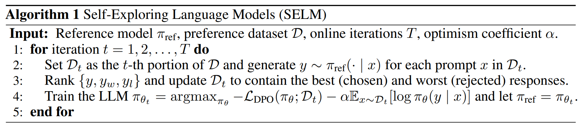
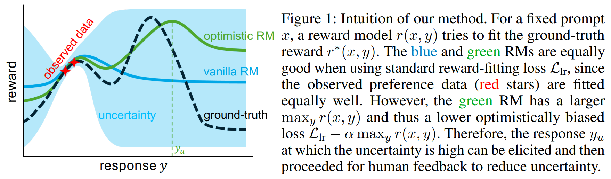

# Self-Exploring Language Models (SELM)

Code for [Self-Exploring Language Models: Active Preference Elicitation for Online Alignment](https://arxiv.org/abs/2405.19332).

Authors: [Shenao Zhang](https://shenao-zhang.github.io)¹, [Donghan Yu](https://plusross.github.io/)², [Hiteshi Sharma](https://scholar.google.com/citations?user=-9geUIIAAAAJ)², [Ziyi Yang](https://ziyi-yang.github.io/)², [Shuohang Wang](https://sites.google.com/site/shuohangsite/)², [Hany Hassan](https://www.microsoft.com/en-us/research/people/hanyh/)², [Zhaoran Wang](https://zhaoranwang.github.io)¹.

¹Northwestern University,  ²Microsoft




🤗 <a href="https://huggingface.co/collections/ZhangShenao/selm-zephyr-66564a84765632c7cce38b25" target="_blank">Zephyr Models</a>\
🤗 <a href="https://huggingface.co/collections/ZhangShenao/selm-llama-66564aa2024269cbcfc39171" target="_blank">Llama-3 Models</a>\
🤗 <a href="https://huggingface.co/collections/ZhangShenao/selm-phi-66564aa7323470ad86aac21d" target="_blank">Phi-3 Models</a>

## Run the Code

To run the code in this project, first, create a Python virtual environment using e.g. Conda:

```shell
conda create -n selm python=3.10 && conda activate selm
```

You can then install the remaining package dependencies as follows:

```shell
 python -m pip install .
```

You will also need Flash Attention 2 installed, which can be done by running:

```shell
python -m pip install flash-attn==2.3.6 --no-build-isolation
```

Next, log into your Hugging Face account as follows:

```shell
huggingface-cli login
```

Finally, install Git LFS so that you can push models to the Hugging Face Hub:

```shell
sudo apt-get install git-lfs
```

To train SELM on [Meta-Llama-3-8B-Instruct](https://huggingface.co/meta-llama/Meta-Llama-3-8B-Instruct), you need to first apply for the access. To train SELM on [Phi-3-mini-4k-instruct](https://huggingface.co/microsoft/Phi-3-mini-4k-instruct), upgrade vllm by `pip install vllm==0.4.2`.

Replace `HF_USERNAME` in `train_zephyr.sh`, `train_llama.sh`, `train_phi.sh` with your huggingface username.
After the above preparation, run the following commands:

Train SELM on [Zephyr-SFT](https://huggingface.co/HuggingFaceH4/mistral-7b-sft-beta):
```shell
sh run_zephyr.sh
```

Train SELM on [Meta-Llama-3-8B-Instruct](https://huggingface.co/meta-llama/Meta-Llama-3-8B-Instruct):
```shell
sh run_llama.sh
```

Train SELM on [Phi-3-mini-4k-instruct](https://huggingface.co/microsoft/Phi-3-mini-4k-instruct):
```shell
sh run_phi.sh
```

## Citation

```bibtex
@misc{zhang2024selfexploring,
      title={Self-Exploring Language Models: Active Preference Elicitation for Online Alignment}, 
      author={Shenao Zhang and Donghan Yu and Hiteshi Sharma and Ziyi Yang and Shuohang Wang and Hany Hassan and Zhaoran Wang},
      year={2024},
      eprint={2405.19332},
      archivePrefix={arXiv},
      primaryClass={cs.LG}
}
```

## Acknowledgement
This repo is built upon [The Alignment Handbook](https://github.com/huggingface/alignment-handbook). We thank the authors for their great work. 
